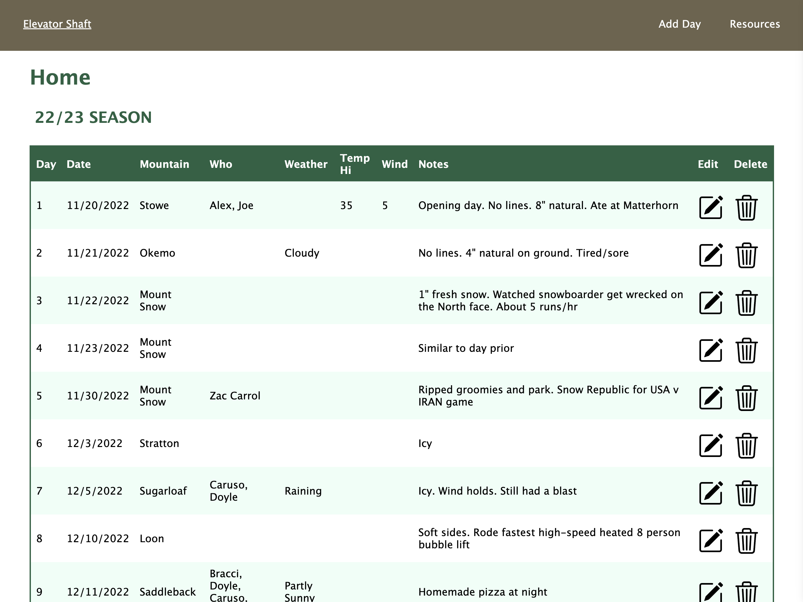
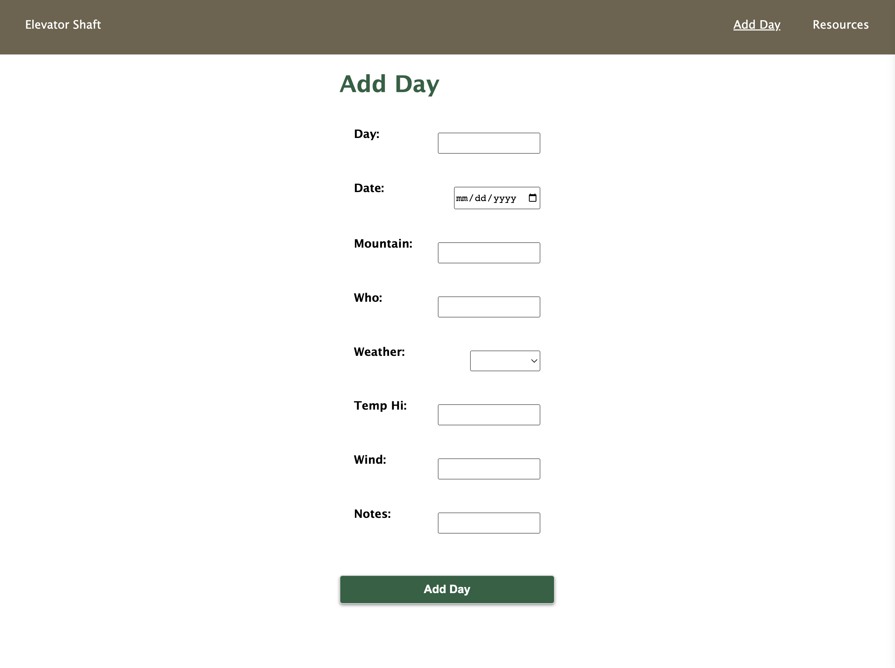

# Elevator Shaft

## Summary

#### With a passion for snowboarding and having a history of logging my snowboarding sessions on a generic notes app, I created this webapp as a custom way to log my data in a more organized and user-friendly way. 

#### Technologies Used: Mongoose, Express/EJS, Node.js, HTML, CSS

#### Live Link: (Please do not delete any data) https://tranquil-woodland-81538-38b7cb910cd5.herokuapp.com/ 

## Future Improvements

#### - Add a page that includes season total data (number of days at each mountain, total number of mountains, average high temperature, how many days each month)

#### - Add the ability to set a goal (number of days for a season) which gets displayed in the center of the header and shows progress (21/50)

#### - Add a login option so multiple users can have their own data. Allow users to share data?

#### - Make days automatically listed in order by date, as opposed to the order they were added

## Unsolved Problems

#### - Create a unique id for every delete button so the javascript function that asks "are you sure you want to delete" applies to each day

## Photos

